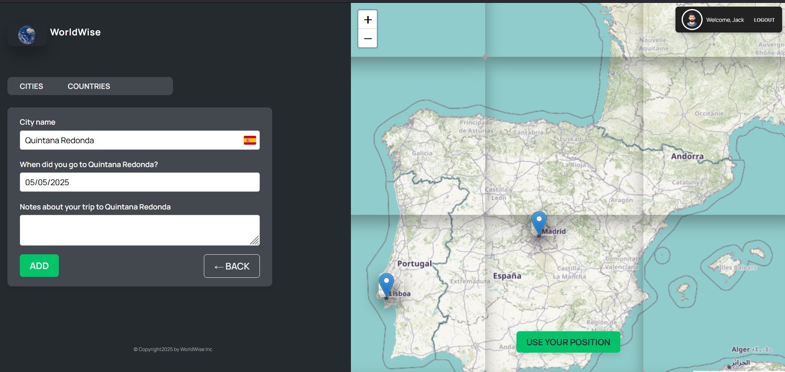
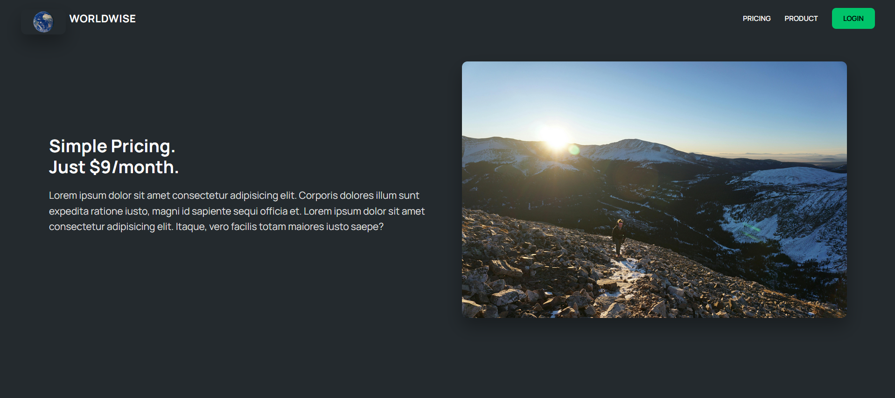

# 🌍 WorldWise

**WorldWise** is a sleek and interactive React application that allows users to
explore and bookmark cities around the world. It uses React Router for routing,
Context + useReducer for state management, and JSON Server as a mock backend.

---

## 📸 Demo

### 🗺️ Map


### 🏙️ Add City



### 💵 Price Page



## 📦 Features

- Add and delete cities from a list
- View country details of cities
- Protected routes using authentication
- Responsive and modern UI
- Simulated backend using JSON Server

---

## 📁 Project Structure

data /public /src ├── components ├── contexts ├── pages ├── App.jsx ├── main.jsx
└── index.css netlify.toml README.md

---

## ⚙️ Installation & Setup

### 1. Clone the repository

```bash
git clone https://github.com/your-username/worldwise.git
cd worldwise
```

### 📦 Install Dependencies

````bash
npm install

## Run JSON Server for Fake Backend

npm run json-server

## 🔒 Authentication

    Fake login using hardcoded credentials

    Protected routes using useAuth and ProtectedRoute components


---


```md
## 👤 Author

- GitHub: [@Miss-marvis](https://github.com/Miss-marvis)


  ## 🚀 Live Demo

[👉 View Live App](https://your-netlify-url.netlify.app)

````

# WorldWise
